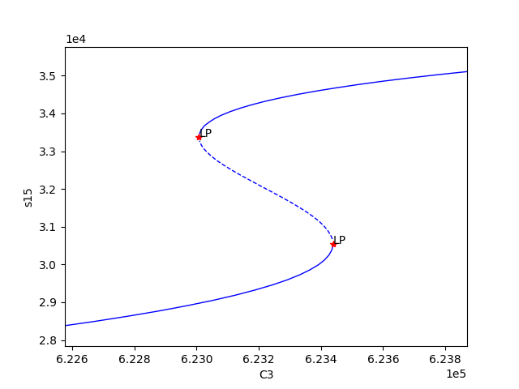

.. _my-deficiency-label:

=========================================
Mass Conservation Approach Walkthrough
=========================================

Using the SBML file constructed as in :ref:`my-celldesigner-label`, we will proceed by completing a more in-depth
explanation of running the mass conservation approach of :cite:`irene`. Note that the mass conservation approach can
be ran on any network that has conservation laws, even if that network does have a sink/source. One can test whether or
not there are conservation laws by seeing if the output of :func:`crnt4sbml.Cgraph.get_dim_equilibrium_manifold` is
greater than zero. This tutorial will use :download:`Fig1Ci.xml <../sbml_files/Fig1Ci.xml>`.
The following code will import crnt4sbml and the SBML file. For a little more detail on this process consider :ref:`my-basic-label`.

.. code-block:: python
   
   import crnt4sbml
   network = crnt4sbml.CRNT("/path/to/Fig1Ci.xml")

If we then want to conduct the mass conservation approach of :cite:`irene`, we must first initialize the
mass\_conservation\_approach, which is done as follows:

.. code-block:: python

    opt = network.get_mass_conservation_approach()

This command creates all the necessary information to construct the optimization problem to be solved. Along with this,
the initialization will also attempt to obtain a linear form of the Equilibrium Manifold. Note that this process may take
several minutes for larger networks. For more detail on this process consider :ref:`manifold-label`. The following is the
output provided by the initialization::

    Creating Equilibrium Manifold ...
    Elapsed time for creating Equilibrium Manifold: 1.992364

One very important value that must be provided to the optimization problem are the bounds for the decision vector of the
optimization problem. For this reason, it is useful to see what decision vector was constructed. To do this one can add
the following command to the script:

.. code-block:: python
 
    print(opt.get_decision_vector())

This provides the following output::

    [re1, re1r, re2, re3, re3r, re4, re5, re5r, re6, s2, s6, s15]

To obtain more available functions  that this initialization provides, see :meth:`crnt4sbml.MassConservationApproach`.
Using the decision vector provided, one can then construct the bounds which are necessary for the optimization problem
by creating a list of tuples where the first element corresponds to the lower bound value of the parameter and the second
element is the upper bound value of the parameter.

In addition to the bounds for the decision vector, we must also supply the bounds for those species' concentrations that
are not defined in the decision vector. To see the order and those species' concentration bounds that you need to provide
bounds for, we can use the following command:

.. code-block:: python

    print(opt.get_concentration_bounds_species())

This provides the following output::

    [s1, s3, s7, s16]

This tells us that we need to provide a list of four tuples that correspond to the lower and upper bounds for the
species s1, s3, s7, and s16, in that order.

As creating these bounds is not initially apparent to novice users or may become cumbersome, we have created a function
call that will automatically generate physiological bounds based on the C-graph. To use this functionality one can
add the following code:

.. code-block:: python

    bnds, conc_bnds = opt.get_optimization_bounds()

This provides the following values::

    bnds = [(1e-08, 0.0001), (1e-05, 0.001), (0.001, 1.0), (1e-08, 0.0001), (1e-05, 0.001), (0.001, 1.0),
            (1e-08, 0.0001), (1e-05, 0.001), (0.001, 1.0), (0.5, 500000.0), (0.5, 500000.0), (0.5, 500000.0)]

    conc_bnds = [(0.5, 500000.0), (0.5, 500000.0), (0.5, 500000.0), (0.5, 500000.0)]

For more information and the correctness on these bounds please refer to :ref:`physio-bnds-label`.

The next most important parameter for optimization is the number of initial points in the feasible point method (please
see :ref:`my-optimization-label` for a detailed description of the optimization routine). It is usually good practice to
run the optimization with 100 initial points and observe the minimum objective function value achieved. If an objective
function value smaller than machine epsilon is not achieved, it is best to rerun the optimization with more initial
points. If 10000 or more points are used and an objective function value smaller than machine epsilon is not achieved,
then it is possible that the network does not produce bistability (although this test does not exclude the possibility
for bistability to exist, as stated in the theory). We state the number of feasible points below.

.. code-block:: python

    num_itr = 100

The last values that can be defined before the optimization portion are the sys\_min\_val which states what value of the
objective function should be considered as zero (below we set this to machine epsilon), the seed for the random number
generation in the optimization method (below we set this to 0 so we can reproduce the results, None should be used if we
want the method to be random), the print\_flag which tells the program if the objective function value and decision
vector for the feasible point and multi-start method should be printed out (here we set it to False, which means no
output will be provided), and numpy\_dtype which tells the program the numpy data type that should be used in the
optimization method (here we set it to a float with 64 bits). Note that higher precision data types will increase the
runtime of the optimization, but may produce better results. See :func:`crnt4sbml.MassConservationApproach.run_optimization`
for the default values of the routine.

.. code-block:: python

   	import numpy 

	sys_min = numpy.finfo(float).eps
	sd = 0
	prnt_flg = False
	num_dtype = numpy.float64

Using these values, we run the optimization problem using the following command, which returns a list of the parameters
(which correspond to the decision vectors) and corresponding objective function values that produce an objective function
value smaller than machine epsilon.

.. code-block:: python

    params_for_global_min, obj_fun_val_for_params = opt.run_optimization(bounds=bnds, concentration_bounds=conc_bnds,
                                                                         iterations=num_itr, seed=sd, print_flag=prnt_flg,
                                                                         numpy_dtype=num_dtype, sys_min_val=sys_min)

The following is the output obtained by the constructed model::

    Running feasible point method for 100 iterations ...
    Elapsed time for feasible point method: 29.199651999999997

    Running the multistart optimization ...

    Smallest value achieved by objective function: 0.0

    Elapsed time for multistart method: 136.14538600000003

At this point it may also be helpful to generate a report on the optimization routine that provides more information.
To do this execute the following command:

.. code-block:: python

	opt.generate_report()

This will provide the following output::

    The number of feasible points that satisfy the constraints: 99
    Total feasible points that give F(x) = 0: 28
    Total number of points that passed final_check: 28

The first line tells one how many initial points satisfy the constraints after the feasible point method is ran. Note
that there should always be a nonzero amount provided here, if a nonzero amount is not given, new bounds should be
considered. The second line describes how many feasible points provide an objective function value smaller than sys\_min\_val.
The last line outputs the number of feasible points that produce an objective function value smaller than sys\_min\_val
that also pass all of the constraints of the optimization problem. Note that it is not uncommon for the value provided
in the last line to be smaller than the value provided in the second line. Given the optimization may take a long time
to complete, it may be important to save the parameters produced by the optimization. This can be done as follows::

	numpy.save('params.npy', params_for_global_min)

this saves the list of numpy arrays representing the parameters into the npy file params. The user can then load these
values at a later time by using the following command::

	params_for_global_min = numpy.load('params.npy') 

Now that we have obtained some parameters that have achieved an objective function value smaller than sys\_min\_val, we
can conduct numerical continuation to see if the parameters produce bistability for the ODE system provided by the
network. The most important parameters that must be provided by the user are the principal continuation parameter (PCP)
and the species you would like to compare it against. For more information on numerical continuation and these values
see :ref:`my-continuation-label`. To select the PCP one needs to know which conservation law to choose. The following
command will provide the conservation laws derived by the deficiency manager:

.. code-block:: python 

	print(opt.get_conservation_laws())

This provides the following output::

	C1 = 1.0*s16 + 1.0*s7
	C2 = 1.0*s2 + 1.0*s3
	C3 = 1.0*s1 + 2.0*s15 + 1.0*s16 + 1.0*s3 + 1.0*s6

here the left hand side of the equation corresponds to the constant that reflects the total amount of the leading species.
It is one of these constants that should be provided to the numerical continuation routine. For this example we choose
a PCP of C3 (total amount of species :math:`A`) and the species s15 (species :math:`AA^*`) for the y-axis of the
bifurcation diagram.

.. code-block:: python

	spcs = "s15"
	PCP_x = "C3"

Now we can call the numerical continuation routine. First we set the species and pass in the parameters we obtained from
the optimization routine. The next input we provide is a dictionary representation of the AUTO 2000 parameters, to obtain
a description of these parameters and more options refer to :download:`AUTO parameters <auto2000_input.pdf>`. Please note
that one should **not** set 'SBML' or 'ScanDirection' in these parameters as these are automatically assigned. It is
absolutely necessary to set PrincipalContinuationParameter in this dictionary.

Here we set the maximum stepsize for numerical continuation, DSMAX to 1e3. However, for certain runs of the numerical
continuation this may produce jagged plots. Smaller values should be used if one wants to obtain a smoother plot,
although it should be noted that this will increase the runtime of the numerical continuation. We also state the
principal continuation parameter range by defining 'RL0' and 'RL1', the lower and upper bound for the parameter,
respectively. In addition to this range, the lower and upper bounds for the measure of the error is also provided as
'A0' and 'A1', respectively.

Once we have set the AUTO parameters, we tell the numerical continuation routine whether or not to print out the labels
obtained by the numerical continuation routine. Please refer to :ref:`my-continuation-label` for a description of this
print out. The next value we provide is the string representation of the directory where we would like to store the
multistability plots, if any are found (here we choose to create the stability_graphs directory in the current directory).
The last value provided is an error\_log\_flag which tells the numerical continuation routine whether or not the log
output provided by AUTO is suppressed.

Using this input we can now run the numerical continuation routine on the parameters that pass the constraints of the
optimization problem and produce an objective function value smaller than sys\_min\_val. This is done below.

.. code-block:: python

    multistable_param_ind, plot_specifications = opt.run_continuity_analysis(species=spcs, parameters=params_for_global_min,
                                                                             auto_parameters={'PrincipalContinuationParameter': PCP_x,
                                                                                              'RL0': 1e2, 'RL1': 1e6, 'A0': 0.0, 'A1': 5e6,
                                                                                              'DSMAX': 1e3},
                                                                             print_lbls_flag=False, dir_path="./stability_graphs",
                                                                             error_log_flag=True)

In addition to putting the multistability plots found into the path dir\_path, this routine will also return the indices of
params\_for\_global\_min that correspond to these plots named "multistable_param_ind" above. Along with these indices,
the routine will also return the plot specifications for each element in "multistable_param_ind" that specify the range
used for the x-axis, y-axis, and the x-y values for each special point in the plot (named "plot_specifications" above).
Also note that if multistability plots are produced, the plot names will have the following form:
PCP\_species id\_index of params\_for\_global.png. The output provided by the numerical continuation run is as follows::

    Running continuity analysis ...
    Elapsed time for continuity analysis: 25.02327585220337

Again, we can generate a report that will contain the numerical optimization routine output and the now added information
provided by the numerical continuation run.

.. code-block:: python

    opt.generate_report()

This provides the following output that describes that of the 28 parameter sets that passed the constraints of the
optimization problem, 14 of them produce multistability for the given input. In addition to this, it also tells one the
indices in params\_for\_global\_min that produce multistability. In practice, larger ranges for the principal continuation
parameter may be needed, but this will increase the runtime of the numerical continuation routine.

::

    The number of feasible points that satisfy the constraints: 99
    Total feasible points that give F(x) = 0: 28
    Total number of points that passed final_check: 28
    Number of multistability plots found: 14
    Elements in params_for_global_min that produce multistability:
    [4, 11, 12, 14, 15, 16, 19, 20, 21, 22, 23, 24, 26, 27]

The following is a bistability plot produced by element 26 of params\_for\_global\_min. Here the solid blue line
indicates stability, the dashed blue line is instability, and the red stars are the special points produced by the
numerical continuation.

In addition to providing this more hands on approach to the numerical continuation routine, we also provide a greedy
version of the numerical continuation routine. With this approach the user just needs to provide the species, parameters,
and PCP. This routine does not guarantee that all multistability plots will be found, but it does provide a good place to
start finding multistability plots. Once the greedy routine is ran, it is usually best to return to the more hands on
approach described above. Note that as stated by the name, this approach is computationally greedy and will take a longer
time than the more hands on approach. Below is the code used to run the greedy numerical continuation:

.. code-block:: python

    multistable_param_ind, plot_specifications = opt.run_greedy_continuity_analysis(species=spcs, parameters=params_for_global_min,
                                                                                    auto_parameters={'PrincipalContinuationParameter': PCP_x})

    opt.generate_report()

This provides the following output::

    Running continuity analysis ...
    Elapsed time for continuity analysis: 143.82169270515442

    The number of feasible points that satisfy the constraints: 99
    Total feasible points that give F(x) = 0: 28
    Total number of points that passed final_check: 28
    Number of multistability plots found: 19
    Elements in params_for_global_min that produce multistability:
    [3, 4, 6, 7, 11, 12, 14, 15, 16, 17, 19, 20, 21, 22, 23, 24, 25, 26, 27]

Note that some of these plots will be jagged or have missing sections in the plot. To produce better plots the hands on
approach should be used.

For more examples of running the mass conservation approach please see :ref:`further-examples-label`.
